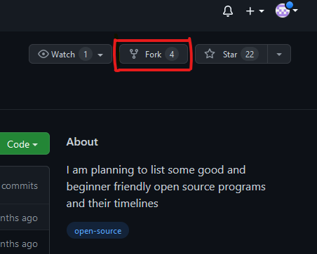
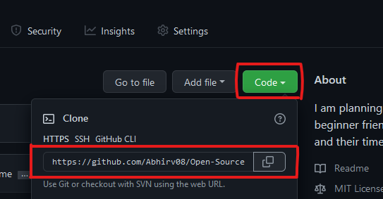

# Open-Source-Programs

I am planning to list some good and beginner friendly open source programs and their timelines

| Program Name                                                              | Details                                                                                                                                        | Duration                | TimeLine                                                                | Rewards                                                                                                                                        |
| ------------------------------------------------------------------------- | ---------------------------------------------------------------------------------------------------------------------------------------------- | ----------------------- | ----------------------------------------------------------------------- | ---------------------------------------------------------------------------------------------------------------------------------------------- |
| [Girlscript Summer of Code](https://gssoc.girlscript.tech/)               | 3 month long Open Source program during summers conducted by GirlScript Foundation                                                             | 1st March- 31st May     | [TimeLine](https://gssoc.girlscript.tech/schedule.html)                 | Cash Prize to top 3 <br> T-shirts and Swags to top 50                                                                                          |
| [Bountiful Open Source Summer (BOSS)](https://lab.codingblocks.com/boss)  | 4 month long Open Source program                                                                                                               | 15-May to 15th Aug      | [Timeline](https://github.com/coding-blocks)                            | The prizes are subject to the student having collected a minimum of 1000 bounty points.                                                        |
| [Google Summer of Code](https://summerofcode.withgoogle.com/)             | 3 month long Open Source program conducted by Google Summer of Code                                                                            | 1-June to 24th Aug      | [Timeline](https://summerofcode.withgoogle.com/how-it-works/#timeline/) | Google Summer of Code will provide minimum 3000 USD Stipend and maximum 6000 USD Stipend depending on your country and certificate at the end. |
| [LetsGrowMore Summer Of Code (LGMSOC)](https://letsgrowmore.in/soc/)      | 1 month Open Source program                                                                                                                    | 10-June to 10th July    | [Timeline](https://forms.gle/gRgKf3jY1Fg2qv7f8)                         | Swags                                                                                                                                          |
| [PClub Summer Of Code](http://www.pclubsummerofcode.in/)                  | 2 month long Open Source program during summers conducted by Programming Club, UIET                                                            | 3-July to 31st August   | [Timeline](http://www.pclubsummerofcode.in/)                            | Certificates                                                                                                                                   |
| [NJACK Winter of Code(NWoC)](https://njackwinterofcode.github.io/)        | 1 month Open Source program by NJACK, IIT Patna                                                                                                | 1-Dec to 6th January    | [Timeline](https://njackwinterofcode.github.io/timeline.html)           | Certificates                                                                                                                                   |
| [Kharagpur Winter of Code (KWoC)](https://kwoc20.kossiitkgp.org/)         | 1 month Open Source program by IIT Kharagpur                                                                                                   | 6-Dec to 4th January    | [Timeline](https://kwoc20.kossiitkgp.org/#tline)                        | Certificates                                                                                                                                   |
| [Winter of Code](https://winterofcode.com/)                               | 1 month-long programming project with an open-source organization.                                                                             | 7-Dec to 5th January    | [Timeline](https://winterofcode.com/)                                   | Swags                                                                                                                                          |
| [Season of KDE](https://season.kde.org/)                                  | 3 month-long Open Source Program.                                                                                                              | 13-Jan to 9th April     | [Timeline](https://season.kde.org/)                                     | Certificate & Swags                                                                                                                            |
| [JGEC WINTER OF CODE](https://jwoc2k20.tech/index.html)                   | 1 month Open Source Program.                                                                                                                   | 21-Jan to 19th February | [Timeline](https://jwoc2k20.tech/index.html)                            | Certificate & Swags                                                                                                                            |
| [Summer of Innovation ](https://oss2019.github.io/SoI.html)               | 3 month long Summer of Innovation by OSS IIT Dharwad                                                                                           | 6-May to 28th July      | [Timeline](https://oss2019.github.io/SoI.html)                          | Certificate & Swags                                                                                                                            |
| [DevIncept](https://contribute.devincept.com/)                            | 30-Day Contribution Program                                                                                                                    | 10-July to 10th Aug     | [Timeline](https://contribute.devincept.com/)                           | Certificates and Swags                                                                                                                         |
| [GirlScript Winter of Contributing (GWOC)](https://gwoc.girlscript.tech/) | GirlScript Winter of Contributing is a three-month newly established initiative by GirlScript Foundation                                       | 1st Aug-1st Dec         | [TimeLine](https://gwoc.girlscript.tech/#timeline-heading)              | Cash Prize to top contributors and Certificates and Swags                                                                                      |
| [Hacktoberfest](https://hacktoberfest.digitalocean.com/)                  | Open source is changing the world - one pull request at a time.                                                                                | 1Oct-31st Oct           | [TimeLine](https://hacktoberfest.digitalocean.com/details)              | T-shirt                                                                                                                                        |
| [Delta Winter of Code (DWoC)](https://dwoc.io/)                           | DWoC is a winter long program organised by Delta Force, the coding club of NIT Trichy.                                                         | 18 Oct-31 Jan           | [TimeLine](https://dwoc.io/#timeline)                                   | Certificates and Swags                                                                                                                         |
| [Script Winter of Code SWOC](https://swoc.scriptindia.org/#/)             | Script Winter of Code is an open-source program envisioned by the Script Foundation.                                                           | 1 nov-15 march          | [TimeLine](https://swoc.scriptindia.org/#/#timeline)                    | perks and opportunities.                                                                                                                       |
| [NJACK Winter of Code](https://njackwinterofcode.github.io/)              | NWoC (NJACK Winter of Code) is a program by NJACK (The Official Computer Science Club of IIT Patna)                                            | 22 Oct - 10 Jan         | [TimeLine](https://njackwinterofcode.github.io/timeline.html)           | Swags                                                                                                                                          |
| [Winter of Code](https://winterofcode.com/)                               | Winter of Code is a program aimed to increase participation for the Google Summer of Code program among students in colleges and universities. | Nov-Jan                 | [TimeLine](https://winterofcode.com/)                                   | Exclusive Schwags                                                                                                                              |
| [DevScript Winter of Code 2020](https://devscript.org/woc/)               | Winter of Code is an open-source program envisioned by DevScript that helps understand the paradigm of Open Source contribution.               | Nov-March               | [TimeLine](https://devscript.org/woc/)                                  | Swags                                                                                                                   

# How to start with open source and raise your 1st PR

- fork the repository <br />
  <br /> <br />

- clone the repository using Git command <br />
  <br/> 
  &nbsp; git clone https://github.com/{github_username}/Open-Source-Programs.git
- move to the newly created folder using
  Git command <br />
  &nbsp; ```cd Open-Source-Programs/```
- open in your text editor
- make a new branch and then make the changes.<br/> For making new branch , use this Git command
   <br/> &nbsp; ```git checkout -b {new branch name}```
- check your changes using command
<br/> &nbsp; ```git status```
- save your changes by using command <br/>
&nbsp; ``` git add .```
- commit your changes using command <br/>
 &nbsp; ```git commit -m "your_commit_message"```
- to push your changes to github. Use command
<br/> &nbsp; ```git push origin new_branch_name``` 

## Raising Your 1st PR

After pushing your code, go to the forked repository and click on pull request.


# Must Check These Repos Also

- [Cool Front-End Templates ](https://github.com/arpit456jain/Cool-Front-End_Templates)
- [Amazing Css effects](https://github.com/arpit456jain/Amazing-Css-Effects)
- [Amazing Js Projects](https://github.com/arpit456jain/Amazing-Js-Projects)
- [Web-Development-Path-And-Resources](https://github.com/arpit456jain/Web-Development-Path-And-Resources)

## Getting Started with open source [click here](https://github.com/arpit456jain/Getting-Started-with-open-source)

## Need help in [DSA-Path-And-Important-Questions](https://github.com/arpit456jain/DSA-Path-And-Important-Questions)

## Need Help in [Web-Development-Path-And-Resources](https://github.com/arpit456jain/Web-Development-Path-And-Resources)

## 💬Join Our CodeSmashers Community

Join - https://discord.gg/gtYUZQSjTt

Show some ❤️&nbsp; by giving  to this repo
